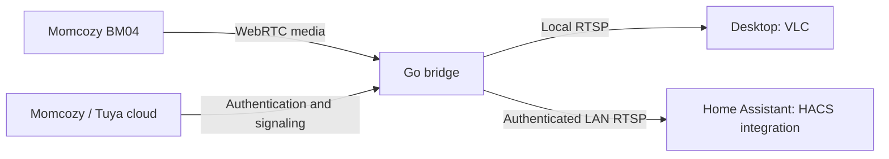

# Momcozy Desktop and HACS

Use your Momcozy BM04 cameras on **Windows, Linux or macOS**, or in
**Home Assistant through HACS**. The Go bridge connects through Momcozy/Tuya
signaling and serves RTSP video and audio to VLC or Home Assistant.

[Download binaries](https://github.com/Gamewalker/Momcozy-Desktop-and-HACS/releases/latest) ·
[Deutsch: Einrichtung](docs/DESKTOP-DE.md) ·
[Desktop guide](docs/BINARIES.md) ·
[Home Assistant / HACS](docs/HOME_ASSISTANT.md)

## Choose your setup

| Goal | What you need | Instructions |
| --- | --- | --- |
| Watch on Windows, Linux or macOS | Bridge binary, VLC, your private camera configuration | [Desktop binaries](docs/BINARIES.md) |
| Watch in Home Assistant, with sound | Reachable bridge **0.1.2+**, FFmpeg on the bridge computer, HACS integration | [Home Assistant setup](docs/HOME_ASSISTANT.md) |
| Prepare a new account | Your Android app APKs, Python and your Momcozy login | [First-time preparation](docs/DESKTOP-DE.md#windows) |
| Build and run from source | Git, Go, Python; VLC for desktop playback | [Windows / Linux / macOS](docs/DESKTOP-DE.md) |

The binaries require no Python or Go for playback. Initial APK/account
preparation still uses the source tools; an existing private configuration can
be transferred from your own installation. No APKs, vendor keys or account
credentials are included. The tested preparation flow uses Android app **3.3.0**
and **DE/EU accounts**. No phone proxy or Android root is needed.

## How it connects

Desktop playback defaults to loopback-only RTSP. For HA on another computer,
configure a LAN listener, dedicated RTSP credentials and a firewall rule scoped
to HA. **HACS installs the camera integration only**; it does not install or
start the bridge. The bridge computer must remain running and awake. No
automatic service or cloud-session renewal is installed.

Cloud authentication and signaling remain required. This is an unofficial,
experimental project, not an offline firmware replacement.

## Audio in Home Assistant

Use bridge **0.1.2 or newer**. In each existing private camera JSON, set
`"audio-format": "aac"` and `"ffmpeg-path"` to your FFmpeg executable. Restart
the bridge, reload the HA camera entry and unmute the player.

AAC conversion changes only audio; video passes through unchanged. The default
`"audio-format": "copy"` keeps the original G.711 path and needs no FFmpeg.
See [complete audio configuration](docs/HOME_ASSISTANT.md#optional-audio-conversion-for-home-assistant).
Version 0.1.2 fixes the BM04 timing issue that caused clicking in 0.1.1.

## Verified behavior and limits

| Area | Status |
| --- | --- |
| Cameras | Two BM04 units, firmware 25.01.08, Android app 3.3.0, EU account |
| Windows desktop | Both cameras decoded at 1920×1080 HEVC and played in VLC |
| Home Assistant | Both cameras deliver video and AAC sound; corrected audio confirmed by listening |
| Automated checks | Go tests, real FFmpeg audio tests, RTSP protocol tests and HA integration tests |
| Linux and macOS | Intel/ARM64 binaries cross-built; physical-camera playback not tested natively |
| Other models/regions | Not verified; account tooling currently implements DE/EU |

Browser video support depends on HEVC compatibility. The bridge does not
transcode video. Long-running reliability, outage recovery and session expiry
need further testing. Talkback is disabled by default. Audio conversion does
not remove microphone/environmental noise.

## Repository and development

- `bridge/`: Go signaling, media transport, optional AAC conversion and binary launcher.
- `client/`, `scripts/`: account preparation, source launchers and release packaging.
- `custom_components/momcozy/`: self-contained HACS integration.
- `tests/`: client and Home Assistant tests; Go tests live beside the Go source.
- [Protocol notes](docs/PROTOCOL.md), [security and private state](docs/SECURITY.md),
  [contributing](CONTRIBUTING.md), [license notices](NOTICE.md).

The repository was renamed from `Gamewalker/momcozy-desktop`. See
[updating an existing installation](docs/HOME_ASSISTANT.md#repository-rename).
Executable names (`momcozy-desktop`), private directory (`~/.momcozy-desktop`)
and HA integration domain (`momcozy`) remain unchanged.

The bridge derives from
[thekoma/aventproxy](https://github.com/thekoma/aventproxy/tree/d15a3117fdf8d0059f59cf451c9d8c0470e8a68a/avent-webrtc-bridge).
Preserve both `LICENSE` and `bridge/LICENSE` when redistributing. Proprietary
Momcozy app assets and native libraries are not included.
